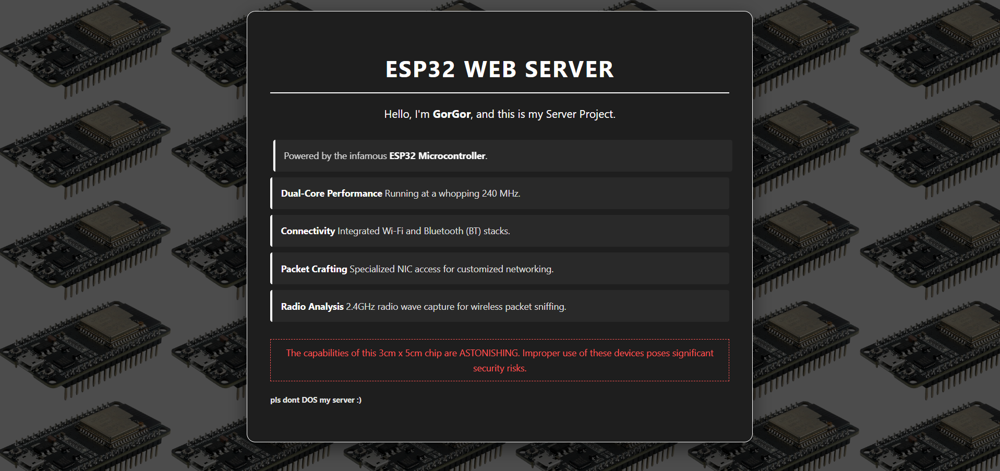

<h2>Result : </h2>
<h3>A working Static Web Server that would accept a request and serve the page and close the connection </h3>
<h3>you can visit the website yourself <a href="http://gorgor.ddns.net">here</a> ! </h3>

<h2>Requirements : </h2>
<ul>
<li>ESP32 microcontroller or dev module </li>
<li>Arduino IDE for coding + the required libraries like esp32 , WiFi and lwip/sockets.h </li>
<li>Optional an Antenna for improved Wifi capabilities to ensure consistance network connectivity </li>
</ul>

<h2>Steps : </h2>
<ul>
<li>Download Arduino IDE</li>
<li>Download the provided WebServerSource.ino file </li>
<li>Open the file in the IDE and upload the code into the ESP32 after pluging it in via USB cable </li>
<li>Make sure the change the SSID + Password for your network and change the default gateway and static ip to match the one given by the DHCP</li>
<li>some times the esp32 will not writable and require some windows COM libraries</li>
</ul>

<h2>Resources : </h2>
<ul>
<li>you can find more information <a href="https://www.espressif.com/en/products/socs/esp32" >here</li>
<li>Here you can buy the <a href="https://ar.aliexpress.com/item/1005006449303342.html?spm=a2g0o.productlist.main.1.697e2886ZQGFEv&algo_pvid=1e270ecf-6d41-4c95-b3cc-2481b1230bbb&algo_exp_id=1e270ecf-6d41-4c95-b3cc-2481b1230bbb-0&pdp_ext_f=%7B%22order%22%3A%224458%22%2C%22spu_best_type%22%3A%22order%22%2C%22eval%22%3A%221%22%2C%22fromPage%22%3A%22search%22%7D&pdp_npi=6%40dis%21SAR%2143.38%2121.77%21%21%2178.78%2139.53%21%40213ba0c517679127399321441e9f70%2112000039288143047%21sea%21SA%212098924531%21X%211%210%21n_tag%3A-29919%3Bd%3A28d0d619%3Bm03_new_user%3A-29895&curPageLogUid=yMrbHHkHpSD6&utparam-url=scene%3Asearch%7Cquery_from%3A%7Cx_object_id%3A1005006449303342%7C_p_origin_prod%3A" >ESP32</a> Dev module</li>
<li><a href="https://www.arduino.cc/en/software/">Here</a> you can download the Arduino IDE </li>
</ul>
